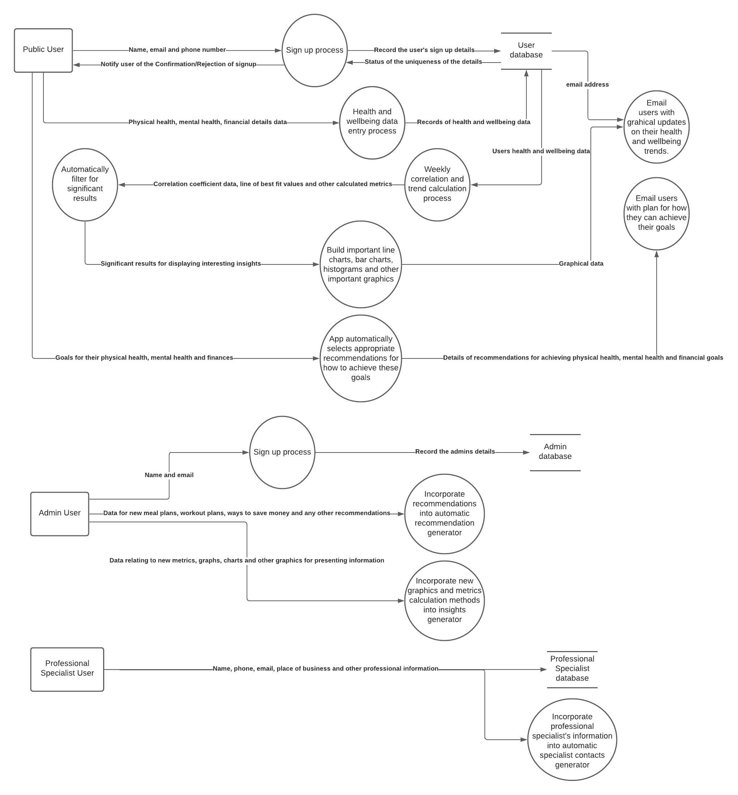
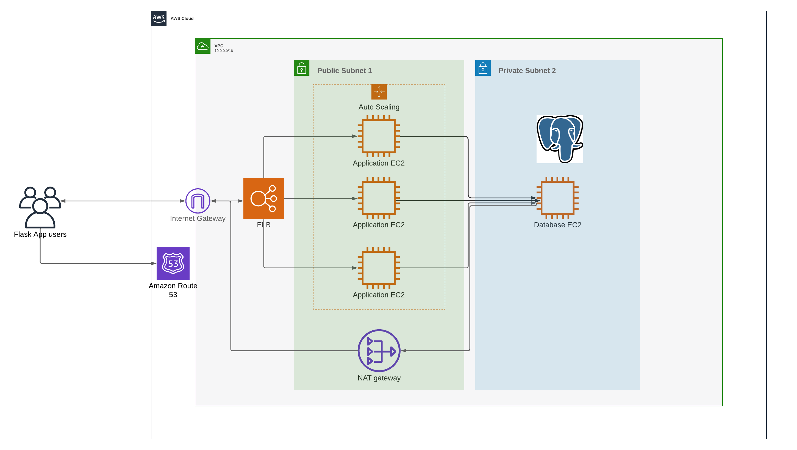
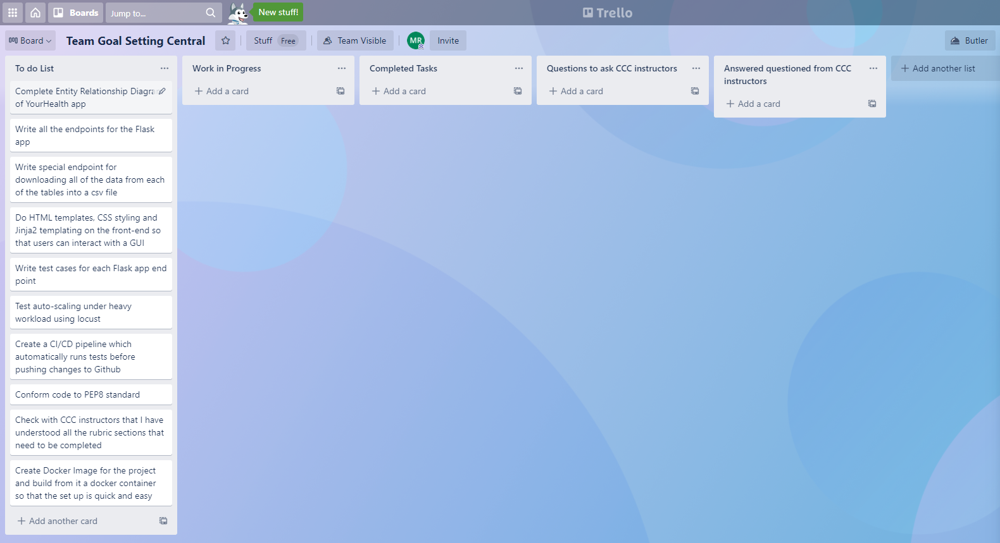
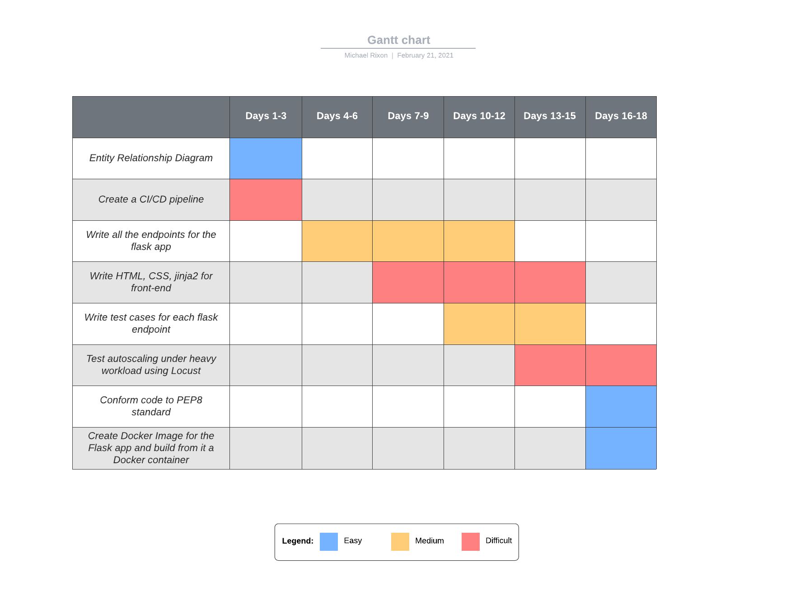
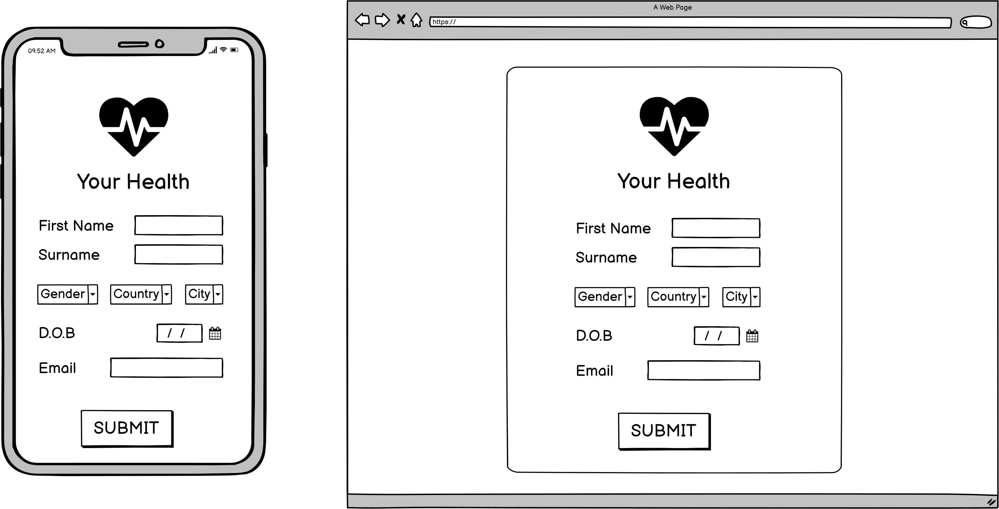
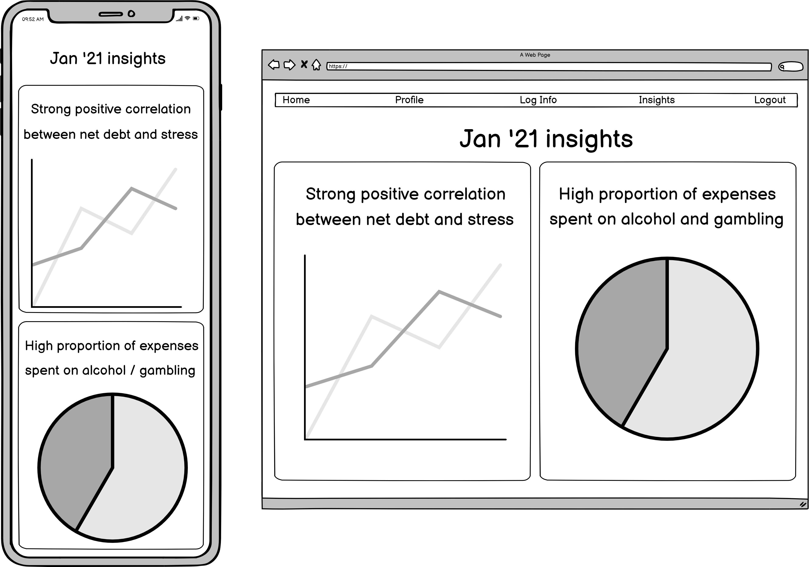

# YourHealth: Better you, everyday!

### Website Description

### Purpose:

This project is designed to track the physical, mental and financial health of an individual. The analytics relating to the user's physical, mental and financial health should all be tracked and this information is to be displayed back to the user in an understandable way. Therefore, the purpose of YourHealth, is to assist the user in monitoring their overall health conditions and get a complete picture of all the significant factors that affect their health and wellbeing. Amongst other health and wellbeing metrics, it will be able to track the user's weight, diet, exercise routine, blood pressure, financial security and mental wellbeing. The intent of building YourHealth is to give the user a very clear picture of every factor that influences their health and wellbeing. Additionally, the app should clearly display how each factor has changed overtime so that user's can see which aspects of their health and wellbeing have been improving and deteriorating. 

For example, a user may well have changed diet, increased their amount of exercise and have lost 10 kg over the past 3 months. They report that feel a lot more energetic and have boosted their self-esteem. They report all of these good changes in their life into the YourHealth app. However, other factors in their life could have deteriorated. The cost of a gym membership and a dietician has caused significant financial distress on them and their performance at work is not as good because they have cut down work hours in order to go to the gym. 

The YourHealth app should account for all factors involved and deliver a clear picture to the user about their overall health and wellbeing profile. 

### Functionality:

**Allow users to enter in their health related data** - The YourHealth app features will allow users to enter in their general profile information along with health and wellbeing data. The general profile information will be obtained from the user when they sign up. They will enter in their name, age, email, date of birth and other profile information. Likewise, the health and wellbeing data will be obtained from the user on a frequent basis. This information includes their weight, diet, financial income and expenses, medication, exercise routine and other relevant data.

**Display graphs and information** - The YourHealth app will have a feature which displays all the relevant information that the user entered in a very understandable format. This feature will have line charts, bar charts, histograms, spider charts and many other powerful visuals that illustrate trends in the user's health and wellbeing over a period of time. Also correlations between metrics can be evaluated to show whether one metric has an affect on another eg. perhaps one user has a strong negative correlation between financial stress and time asleep. When the user is under financial stress, they tend to sleep less. Insights such as this would be of interest to the user and should be displayed to them.

**Highlight areas of significant improvement and deterioration** - There will be an insights page where the areas of significant improvement and deterioration are displayed. This page should be easy to read and the user should be able to immediately recognise which aspects of their health and wellbeing are getting better and which aspects are getting worse.

**Find contacts of specialists** - Users may want professional advice. In this case, there will be an contacts page where nutritionists, financial planners and personal trainers located near the user will have their contact details listed. 

### Target Audience:

The YourHealth app is designed for those people who find it difficult to track their health and wellbeing, or would like to see some insights into their health and wellbeing statistics. By inputting in all of their relevant health and wellbeing data, those users get clear insights into which aspects of their life are improving and alternatively, which aspects are deteriorating. Also correlations between factors can be viewed by the user so that they can see what may be causing the change in their health and wellbeing.

### Tech Stack:

I plan to build this application using a Python Flask App. This flask app will be made up of controllers which contains endpoints. These endpoints will be assessible through making HTTP requests to the flask server. The app will use **HTML**, **CSS** and **jinja2** on the **front-end**. This tech will be user-facing and display the graphical user interface to the end user. The jinja2 will enable the data retrieved from the PostgreSQL database, to be displayed to the user. On the **back-end**, a **PostgreSQL** **database** will be used to store all the user data in relational database tables. 

AWS will be used to spin up two **EC2 instances**. One EC2 instance will host the Flask application and accept traffic from any IP address on the internet. The other EC2 instance will host the PostgreSQL database where the user data is stored. For security reasons, only traffic from the EC2 instance with the Flask app will be accepted. This is to say that the database will not be able to receive queries from the wider internet. It will only be manipulated by the Flask app.

An **application load balancer** will be configured so that incoming traffic from users will be distributed across multiple EC2 instances. This ensures that there is never an overwhelming amount of requests made to a single EC2 instance. Instead, new EC2 instances can be spun up whenever the workload increases so that the response time of each request does not significantly deteriorate.

Finally, a **docker image and container** will be used to store all the instructions in setting up the Flask app and PostgreSQL database on separate EC2 instances. It should be very quick to start up the docker container and run the application.

### Data Flow Diagram:

Ovals represent processes, squares represent user entities and the parallel horizontal lines represent a database table. 

### Application Architecture Diagram:

In my application, there will be at least EC2 instance for the Python Flask Application and exactly  one EC2 instance for hosting the PostgreSQL database. The inbound roles of the Database EC2 instance will be set so that only traffic from the application EC2 instance will be accepted. All other traffic that is not from the EC2 instance of the Flask App, will be rejected. This means that the database itself will only be accessible by the EC2 instance of the Flask Application. 

The Database EC2 instance will host a PostgreSQL. Therefore, the database EC2 instance must be able to send requests to the internet so that the PostgreSQL database itself is able to update itself by accessing new packages on the internet. It will be able to do this through a NAT gateway.

Additionally an Elastic Load Balancer will be used to direct user traffic to a particular Application EC2 instance. Incase there is a spike in traffic, auto scaling rules will be set so that new EC2 instances are spun up to host the Flask Application. The ELB ensure that workload is spread out across the application EC2 instances and that no single application EC2 is overwhelmed with traffic. Once the workload decreases again, the unnecessary EC2 instances can be terminated so that resources are not being wasted.

### User stories:

1. As someone who wants to loose weight and eat healthier food, I want to find an exercise routine and meal plan, and track my progress, so that I remain committed to my goal weight and see how I progress after each week.
2. As a personal trainer, I want to advertise myself to people looking to lose weight, so that I can gain customers and make more business.
3. As a dietician, I want to help people with allergies to still eat healthy, tasty food. This way, I will gain more clients and help grow my brand.
4. As a poor university student, I am frequently running out of money. I want to be able to budget for all my expenses so that I don't need to borrow money from friends in order to pay my rent. 
5. As someone with mental health problems, I find myself unsure what parts of my life are causing me to feel down and depressed. I want to be able to track my level of wellbeing against my eating habits, exercise level and finances so that I can identify what leads me to feel depressed.

### Planning methodology using Trello board and Gantt chart:

In order to plan out the tasks to complete for my Python Flask App, I will be using a Trello board. 

Normally, in a real company scenario, there would be things to do before planning out a project. The project manager in the team would need to **talk to all stakeholders** and understand the **objectives** of the client. Also there would be **budgetary constraints** and a quite limited time frame to work within. There would be a team of developers that must effectively work together to ensure that tasks are not duplicated and that their are no significant roadblocks towards completing a feature. Also there are **risks to prepare for** such as clients changing their requirements half-way through the project or a developer leaving before the project is finished.

Fortunately, this scenario just involves myself, the time constraint is not too strict (3 weeks is enough time to do a Flask app) and there are no important budget constraints to consider.

I will be using a **Trello board**. 

The lists in the trello board are as follows: To do list, Work in Progress, Completed Tasks, Questions to ask CCC instructors and Answered questions from CCC instructors

I believe that to effectively manage a project, I must track the completion of each task from beginning to end. This way, I don't need to rely on memory in order to remember where I am up to in the project. Specifically, it is important to track the tasks that I have not yet started, the tasks in progress and finally the tasks that have indeed been completed. Also, I expect that I will have questions to ask the CCC instructors in regards to my Flask app. Therefore I have a list for that along with the questions that have already received answers.

The trello board above tells me all the tasks that are to be completed in the project and their status. However, it doesn't say anything about how long each task should take and the level of difficulty in completing them. The trello board does not tell me how well I am tracking to my expected time frame. Therefore, I have decided to also use a Gantt chart.

Clearly, the tasks of writing endpoints and completing the front-end are the two major tasks that will take up the most time. Also, I have limited front-end knowledge so I have indicated that the front-end will be difficult. The Gantt chart allows me to plan out more time for the endpoints and front-end since they are quite labor-intensive. It is important to have this time dedicated to those two tasks since I know that they can take a long time. On the other hand, conforming code to PEP8 standards just involves running Flake8 in each file and renaming variables to be more informative. Therefore, I only need to dedicate a few days to it at most.

## Wireframes

### Login Page

### Insights Page

### 